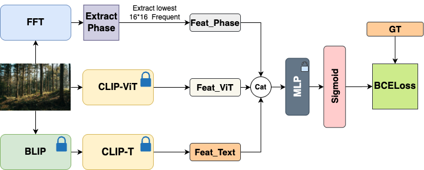

# BCFormer: Blip Clip Fourier Transformer for Multi-label Smoke Detection. 

## Description

BCFormer is a deep learning project focused on multi-label smoke detection using multi modal models such as BLIP, CLIP, with Fourier transform. This repository provides the code and resources necessary to train, validate, and evaluate these models for accurate smoke detection.

## Table of Contents

- [BCFormer: Blip Clip Fourier Transformer for Multi-label Smoke Detection.](#bcformer-blip-clip-fourier-transformer-for-multi-label-smoke-detection)
  - [Description](#description)
  - [Table of Contents](#table-of-contents)
  - [Installation](#installation)
  - [Dataset](#dataset)
  - [Model Structure](#model-structure)
  - [Usage](#usage)
    - [Model Training](#model-training)
    - [Evaluation](#evaluation)
  - [Results](#results)
  - [License](#license)

## Installation

1. **Clone the repository**:
   ```bash
   git clone https://github.com/Sebastian-0912/BCFormer.git
   ```
2. **Navigate to the project directory**:
   ```bash
   cd BCFormer
   ```
3. **Install the required dependencies**:
   ```bash
   pip install -r requirements.txt
   ```
   *Ensure you have Python and pip installed on your system.*

## Dataset

The labeled dataset **NCCUSmoke3K** is available for download:
[Download NCCUSmoke3K](https://drive.google.com/drive/folders/10HV7r-f2RgL2WxBA4VUR9Yo6KNxijjuZ?usp=drive_link)

After downloading, rename the dataset folder to `train_val_dataset` and place it inside the `BCFormer` directory before training.

## Model Structure

The architecture of BCFormer is illustrated below:



## Usage

Alternatively, if your script supports environment variables:
```bash
INPUT_DIR=path/to/raw_data OUTPUT_DIR=path/to/processed_data python preprocess_dataset.py
```

### Model Training

Modify the script to include the correct dataset path and hyperparameters, then run:
```bash
python BCFormer_train.py
```

### Evaluation

Validate the trained model using:
```bash
python BCFormer_val.py
```
Modify the script to specify the correct model path and dataset before running.

## Results


| Metric/Model                   | Extract keyword From BLIP |
| ------------------------------ | ------------------------- |
| Exact Match                    | 40.63%                    |
| Average Label Proportion Score | 75%                       |

|                   | mAP       | CP        | CR        | CF1       | OP        | OR        | OF1       |
| ----------------- | --------- | --------- | --------- | --------- | --------- | --------- | --------- |
| BLIP2text_encoder | 79.23     | 79.97     | 66.43     | 71.70     | 87.79     | 76.00     | 81.47     |
| CLIP2MLP          | 89.45     | 90.45     | 74.63     | 81.13     | **93.27** | 81.14     | 86.78     |
| BCLIP model       | 89.73     | 86.79     | 77.88     | 81.95     | 91.08     | 83.14     | 86.93     |
| BFC model         | **96.19** | **91.83** | **89.54** | **90.66** | 92.85     | **90.86** | **91.84** |

## License

This project is licensed under the MIT License. See the [LICENSE](LICENSE) file for more details.
